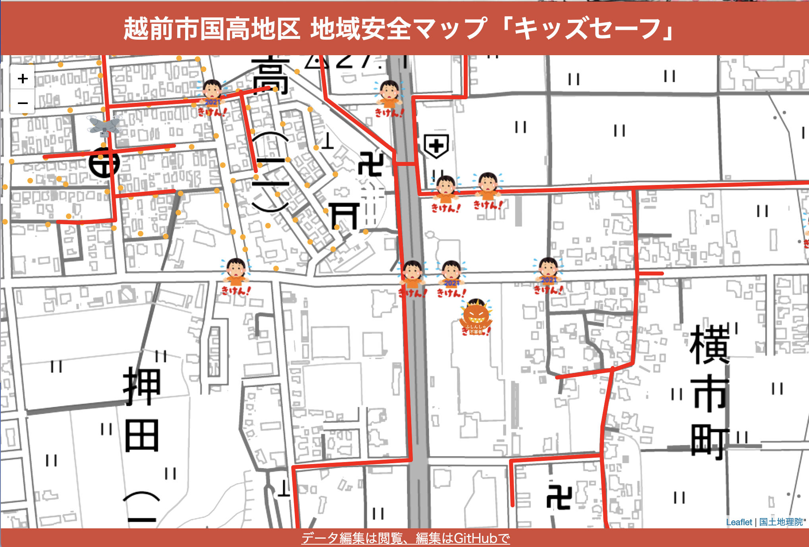
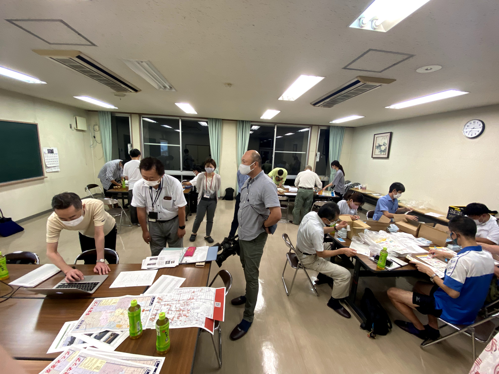
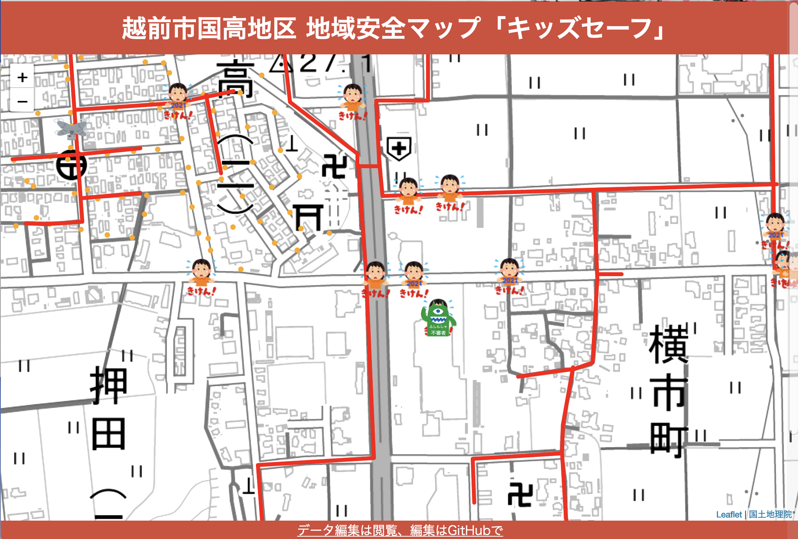
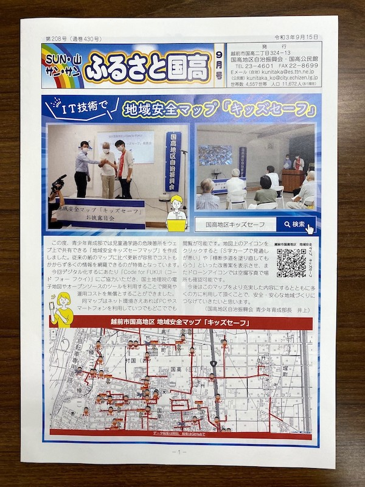

# Code for FUKUI blog

## 2021-09-22

今日は、越前市国高公民館にて国高地区 地域安全 キッズセーフマップの説明会が開かれました。

国高地区は昔から紙媒体のみで安全マップを作成していたそうです。  
しかし、紙は間違えると新しい紙を使ったり、描き重ねると見えづらくなったり…  
  
そこで、地域安全キッズセーフマップの出番です！  

 

データの管理をCSVファイルで行うことで、変更がとても簡単になるのが魅力的です。  
ドローンでの撮影をVRで閲覧出来るのは、実際に行かなくても通学路のことが把握できますね。

今回、国高地区の方は各々110番の家の看板を制作しました。  
各机毎で作業を分ける事で迅速に制作を終えていました。  

   
  
そして、Code for Fukuiからはキッズセーフマップ変更点の説明がありました。

**変更点**  
- 児童通学路の表示  
- 街頭の表示（オープンデータを活用）  
- 不審者情報の追加  

キッズセーフは、オープンデータを活用することでより安全なマップへと更新しました。

しかし！不審者が危険アイコンと似ていて分かりづらいとのご指摘を頂きました…
  
そこで、GitHubはマップの更新がしやすいということを分かっていただく為にも、その場でアイコンを更新しました。

 

他のアイコンより一際目立つ色になりましたね！  
  
このキッズセーフマップを基板にして紙媒体での配布があるそうです。  
次の更新が楽しみですね！  
  
  国高地区の月間お便り「ふるさと国高」で大きく紹介して頂きました。  
  ありがとうございます。
     

***
